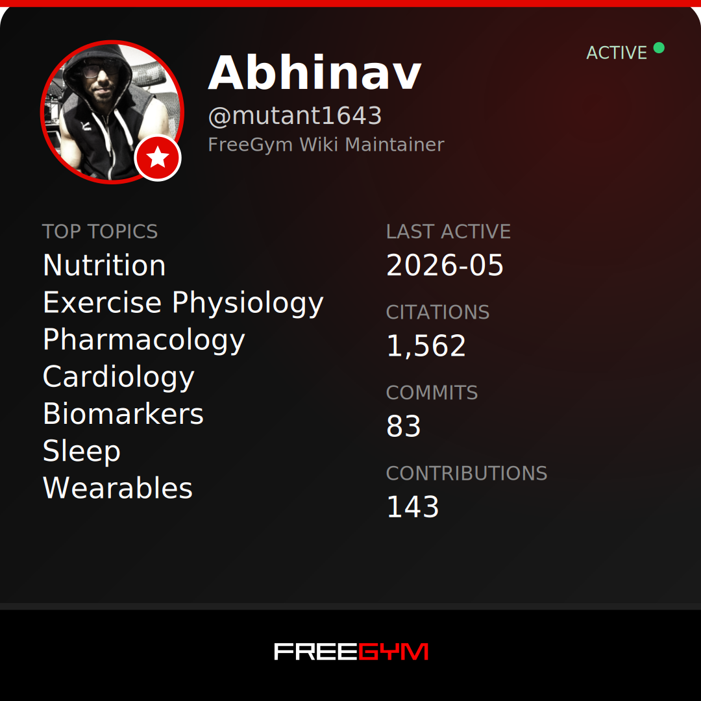

# Verification System

This document explains how contributors earn verification through FreeGym Wiki and what that verification represents.

---

## The Philosophy

Credentials don't make claims true. Evidence does.

A PhD doesn't mean someone is right. A certification doesn't mean someone can be trusted. A million followers definitely doesn't mean someone knows what they're talking about. In health, fitness, and medicine, you can find rigorous and sloppy work from people with and without credentials.

We have made multiple MDs on Twitter/X delete irresponsible tweets after evidence-based pushback. That’s authority bias with almost no accountability. At the same time, uncredentialed creators can make extremely dangerous claims. This repo exists to replace both kinds of authority bias with evidence, and to provide a source of truth that anyone can audit. Science doesn't care about authority bias.

So we don't verify credentials. We verify contributions.

FreeGym is open to anyone, but it isn't a free-for-all. There is no gatekeeping by title or authority, only standards for evidence. Contributions must survive review and meet those standards to be merged. That friction is the point: it keeps quality high and makes reputation earned, not claimed.

When you earn verification here, it doesn't mean "this person has letters after their name." It means:

- This person has contributed peer-reviewed evidence to open health knowledge
- Their work has survived community scrutiny
- Their claims are tied to their public contribution history
- They have skin in the game

Your contribution history becomes your credential. You either have a track record of accurate, well-cited contributions, or you don't. The history is public. Anyone can audit it.

---

## How Verification Works

Verification status is tracked in [contributors.yaml](contributors.yaml) and displayed in [CONTRIBUTORS.md](CONTRIBUTORS.md). When you earn verification, your status is recorded and your profile is auto-generated.

GitHub itself doesn't have visual badges or checkmarks we can assign. What we track:

- **Checkmark status**: Have you contributed substantive evidence-based content?
- **Topic badges**: Which domains have you contributed to?
- **Files contributed**: Which specific pages you created or significantly edited
- **Citation count**: How many peer-reviewed citations you've added
- **Commit count**: Low-weight signal for transparency (easy to game)
- **Last active**: When did you last contribute?

The [CONTRIBUTORS.md](CONTRIBUTORS.md) file displays all this in a readable format. Anyone can see exactly who has earned what, with links to their actual contributions.

---

## Earning Verification

### Red Checkmark (FreeGym)

The red checkmark is a FreeGym badge, not a GitHub feature. On GitHub, verification is recorded in `contributors.yaml` and displayed in `CONTRIBUTORS.md` and the generated cards.

It means: "This person has contributed substantive, evidence-based content to FreeGym Wiki."

**How to earn it:**

One merged Pull Request that adds or improves evidence-based content with proper citations.

**What counts as substantive (maintainer judgment):**

- Adds new claims backed by Tier 1–2 evidence
- Major edit with **≥3 citations** or **≥20 substantive lines**
- Corrects an existing claim with stronger evidence or clearer limitations
- **Does not count:** formatting, wording tweaks, or link fixes only

That's it. No application process. No approval committee. No waiting period. Contribute something real, get it merged, earn the checkmark.

**What counts as substantive:**

- Adding new claims backed by Tier 1-3 evidence
- Improving existing content with better citations or clearer explanations
- Adding nuance, caveats, or limitations that were missing
- Correcting errors with evidence
- Creating new topic files with proper structure and citations

**What does not count:**

- Typo fixes
- Formatting changes
- Whitespace cleanup
- Adding empty templates without content
- Copy-pasting content without adding citations
- Any change that doesn't involve evidence-based claims

The distinction is simple: did your PR add to the body of knowledge, or did it just clean things up? Both are helpful. Only one earns verification.

**How it's tracked:**

Maintainers add the `substantive` label to PRs that qualify. When a labeled PR is merged, the contributor tracker workflow updates `contributors.yaml` with `checkmark: true`.

---

### Topic Badges

Topic badges show which domains you've contributed to. If you've had substantive work merged in the nutrition folder, you earn the Nutrition badge. Same for exercise science, sleep, mental health, and any other topic areas that get added.

**What they signal:**

"This person has demonstrated knowledge in [topic] through actual contributions, not just claims."

Someone might have a checkmark but no Nutrition badge. That tells you they've contributed, but not in nutrition. Someone might have badges in Sleep and Mental Health but not Exercise. That tells you where their work has focused.

**How it's tracked:**

The contributor tracker workflow automatically records which folders each PR touched. Your `topics` field in `contributors.yaml` shows your earned badges.

---

### Maintainer Star

Maintainers get a star designation instead of a checkmark. This is the standout level.

Maintainers don't just contribute. They review others' contributions. They decide what gets merged. They maintain the quality standards that make verification meaningful in the first place.

**How to become a maintainer:**

You don't apply. Existing maintainers identify contributors who consistently demonstrate:

- Accurate, well-cited work
- Constructive engagement in Issues and PR reviews
- Understanding of the evidence hierarchy
- Willingness to update views when presented with better evidence

When maintainers see someone like this, they open an Issue proposing promotion. Other maintainers weigh in. If there's consensus, the contributor becomes a maintainer.

The process is transparent. Anyone can see who proposed whom, who agreed, and why.

---

## Activity Visibility

Verification is permanent. Once earned, always earned.

But activity is visible. The `last_active` field shows when you last contributed. If someone earned their checkmark in 2026 and hasn't contributed since, that's visible. If someone contributed yesterday, that's visible too.

This isn't a penalty system. People have lives. Contributing once and never again doesn't make that contribution less valid. But viewers can see the context.

The date is information, not judgment.

Cards also display an **ACTIVE** tag when someone's `last_active` is within the last 60 days. A scheduled workflow refreshes cards monthly so this recency signal stays up to date.

---

## What's Automated

The contributor tracker workflow handles:

| Automated | Requires Maintainer Action |
|-----------|---------------------------|
| Adding new contributors to yaml | Adding `substantive` label to qualifying PRs |
| Tracking which files were contributed | Promoting contributors to trusted/maintainer |
| Counting citations added (PubMed, DOI, etc.) | Reviewing PR quality |
| Updating `last_active` date | Deciding if content meets evidence standards |
| Generating CONTRIBUTORS.md | |
| Granting checkmark when `substantive` PR merges | |

**Citation counting** recognizes these patterns:
- PubMed links: `[Study](https://pubmed.ncbi.nlm.nih.gov/12345)`
- DOI links: `[Study](https://doi.org/10.1234/...)`
- PMID references: `PMID: 12345`
- Author-year citations: `(Smith et al., 2024)`

The human judgment stays human. Maintainers decide what's substantive. The automation just records those decisions and makes them visible.

For implementation details and auditing, see [docs/automation.md](docs/automation.md).

---

## FreeGym Integration (Future)

FreeGym is a social network for health and fitness. The red checkmark there originally meant "this person posts trustworthy content" based on subjective assessment. That worked when we were small. It doesn't scale.

The plan: verification on FreeGym will come from contributions here.

**What needs to be built:**

1. **GitHub account linking** - FreeGym users connect their GitHub account via OAuth
2. **Verification sync** - FreeGym reads `contributors.yaml` from this repo to check status
3. **Badge display** - FreeGym shows checkmark and topic badges on profiles
4. **Contribution link** - Users can click through to see actual GitHub contribution history

**What this enables:**

When someone sees a red checkmark on FreeGym, they can click through and see exactly what that person contributed. Every claim they've made in this wiki. Every correction they've accepted. Every debate they've engaged in.

The checkmark means: "Don't take my word for it. Here's my track record. Verify it yourself."

This integration is not yet built. Currently, `contributors.yaml` is the source of truth, and FreeGym verification is handled manually based on that file.

## Shareable Proof (Available Now)

Every verified contributor gets:

### 1. Profile Card (SVG)

A visual card showing your verification status, topics, citations, and contributions.

Find your card at: `https://raw.githubusercontent.com/FreeGym/FreeGym-Wiki/main/cards/YOUR_USERNAME.svg`

Share it on social media, embed it anywhere, or screenshot it.

Other sizes for social media:
- Square: `https://raw.githubusercontent.com/FreeGym/FreeGym-Wiki/main/cards/YOUR_USERNAME-square.svg`
- Portrait: `https://raw.githubusercontent.com/FreeGym/FreeGym-Wiki/main/cards/YOUR_USERNAME-portrait.svg`
- Story: `https://raw.githubusercontent.com/FreeGym/FreeGym-Wiki/main/cards/YOUR_USERNAME-story.svg`

### 2. Badge Markdown

Copy-paste badges for your GitHub profile README:

  

Find your personalized badge code in [CONTRIBUTORS.md](CONTRIBUTORS.md) under "Your Badges."

## GitHub Pages Profiles (Future)

A dedicated profile page for each contributor at `https://freegym.github.io/FreeGym-Wiki/contributors/username`:
- Interactive profile with full contribution history
- OpenGraph meta tags for rich link previews on social media
- Embeddable anywhere

---

## The Anti-Gaming Design

Any reputation system can be gamed. This one is designed to make gaming expensive.

| Attack | Defense |
|--------|---------|
| Submit many low-effort PRs | Only PRs with `substantive` label count. Maintainers review everything. |
| Cite bad sources | Evidence hierarchy enforced. Tier 4 sources rejected. |
| Build fake credibility | GitHub accounts have history. Creating convincing fake activity is hard. |
| Hide mistakes | Git history is immutable. Corrections are visible, not deletable. |
| Claim expertise you don't have | Topic badges only come from contributions. No self-reporting. |

The core defense: you can't fake contribution history. It's either there or it isn't. Every PR is reviewed by maintainers who have no incentive to approve garbage. Every claim must cite evidence that others can check. Every change is permanently recorded.

Gaming this system requires actually doing the work. At which point, it's not gaming anymore.

---

## Summary

| Verification | Meaning | How to Earn |
|--------------|---------|-------------|
| Red Checkmark ✓ | Contributed evidence-based content | One substantive merged PR |
| Topic Badge | Demonstrated knowledge in specific area | Merged PR in that topic folder |
| Maintainer Star ⭐ | Curates and maintains quality standards | Invitation from existing maintainers |

**What's visible for each contributor:**
- Specific files they created or edited
- Total citations added
- Commit count (low-weight, easily gamed)
- Topic badges earned
- Last active date

See [CONTRIBUTORS.md](CONTRIBUTORS.md) for the full display.

---

## Questions

If something here is unclear, open an Issue with the `question` label.
